<h1 style='text-align:center'>CS 340 README Project: Grazioso Salvare Search and Rescue Training.</h1>

<h3>About the project: Grazioso Salvare Search and Rescue Training.</h3>

&nbsp;&nbsp; Grazioso Salvare helps in identifying animals for international search-and-rescue training to aid in rescuing animals and people. The project finds good candidates by searching the Austin Animal Center (AAC) database for dogs that fit the client’s needs for where the dog will be searching. Upon searching for the dogs that match, the program will identify those, who are available.

<h3>Usage:</h3>

&nbsp;&nbsp;The project utilizes the C.R.U.D. application made in Python to read through the AAC database and creates a UI that gives the user ease of access to the data that is housed in AAC. The UI is comprised of a dashboard with a database table, two widgets that provide data on the filtered animals, and a dropdown to filter the types of animals to be used depending on conditions. 

<h3>Tools:</h3>
<ul>
    <li>Python – version (3.10+ due to match cases), --modules(Pymongo, Dash, JupyterDash, dash_leaflet, plotly.express, pandas)  --> This was used for the C.R.U.D. application</li>
    <li>MongoDB --> Was used for the cloud server that housed the AAC database.</li>
    <li>Jupyter Notebook --> Was used to create the UI of the application.</li>
    <li>Access to database(user/admin)</li>
</ul>

<h3>How to set up the database:</h3>

The following screenshots show uploading the *.csv file to the MongoDB cloud and making a user for said database:

 
 
 

 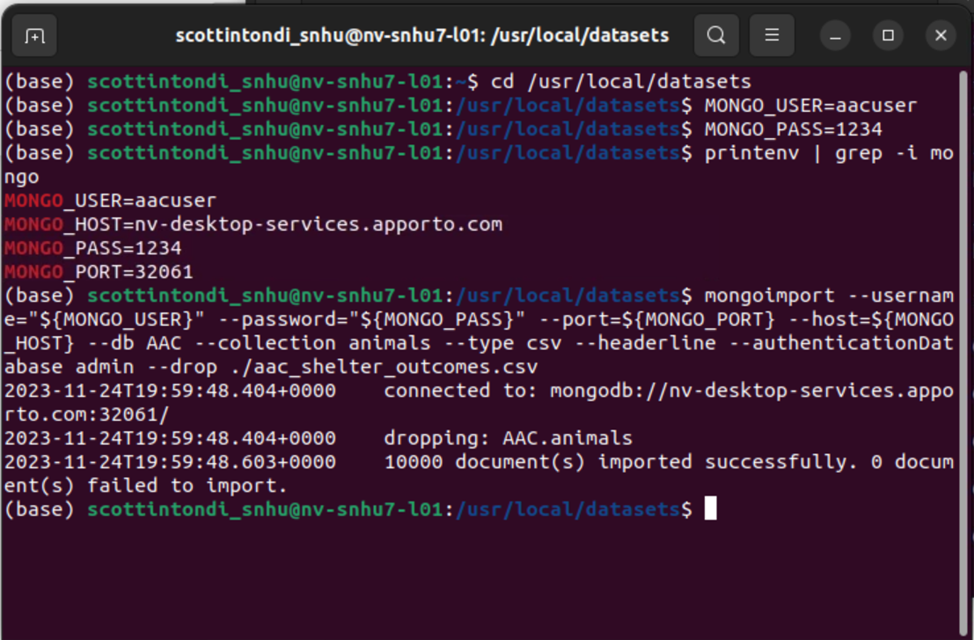
 

To see if  you have access to the database you can open up a jupyter notebook and make a new file with importing the animal_shelter.py script and upon creating the object, you will be greeted with “Connected to Client” is successful screenshot following: 

   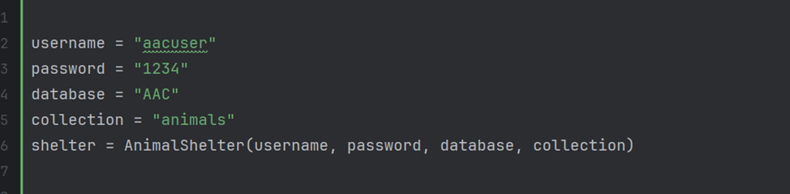
   

  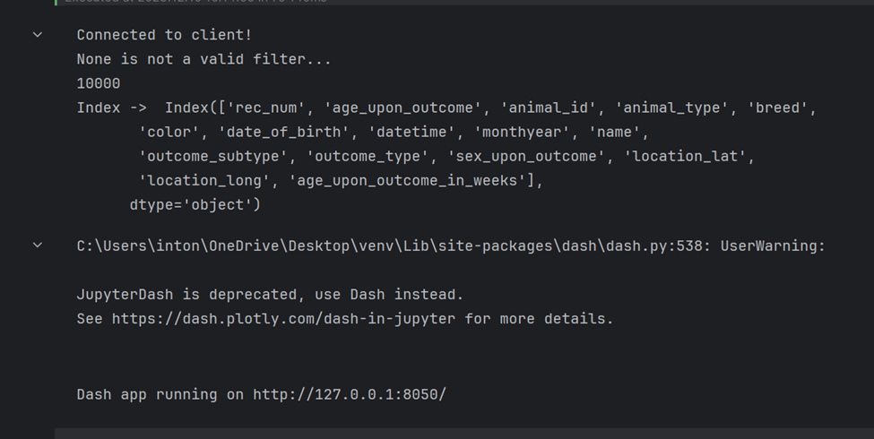
  

Creating the C.R.U.D. interface

 
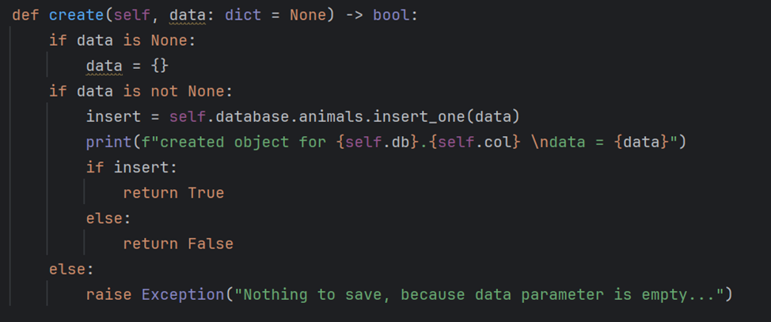

 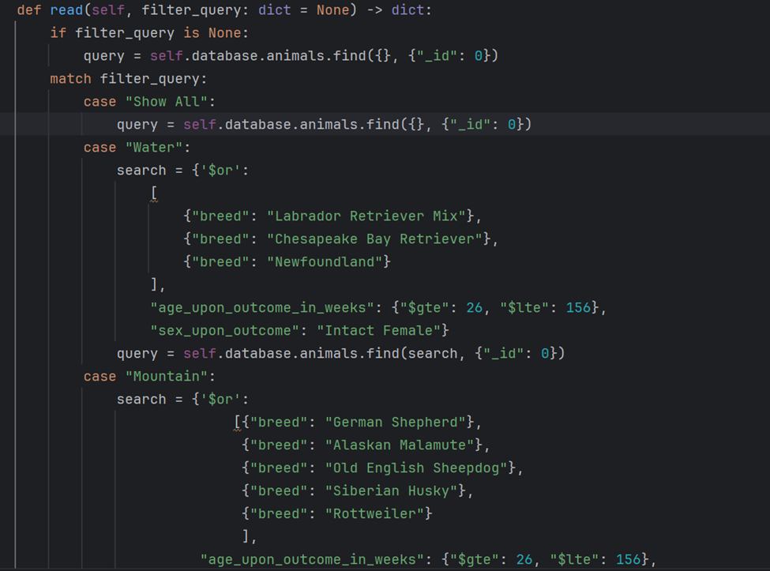
 

 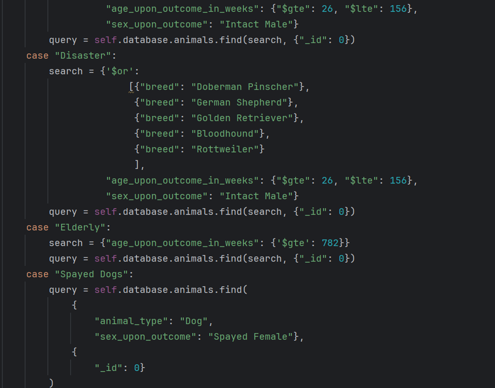
 

 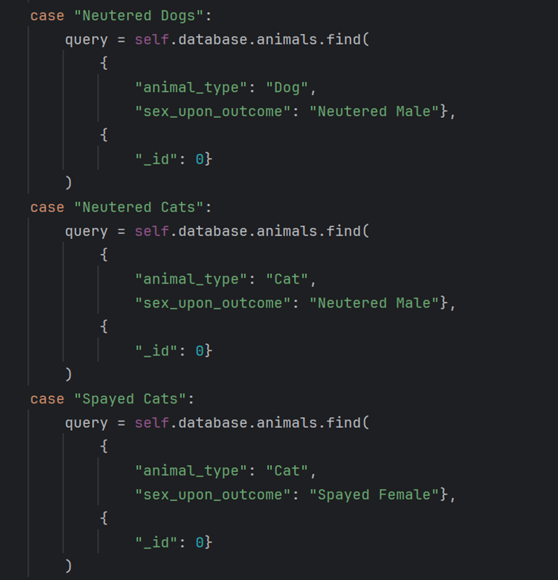
 

 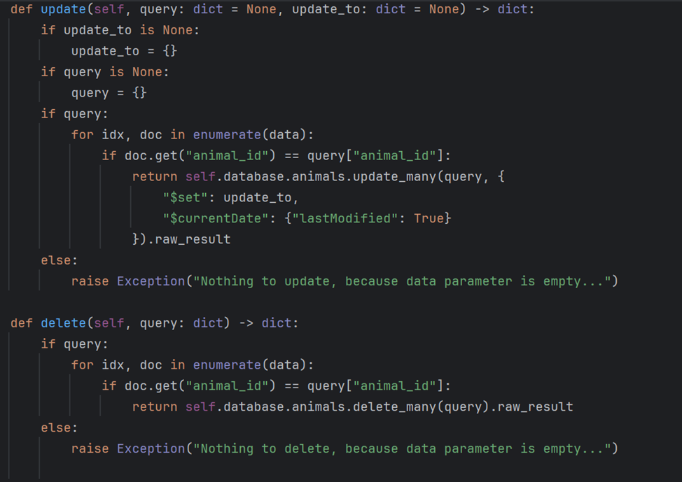

<h3>Dashboard UI for “Show All”, “Water”, “Mountain”, “Disaster”, and “Elderly”:</h3>
<h3>“Show All”:</h3>

 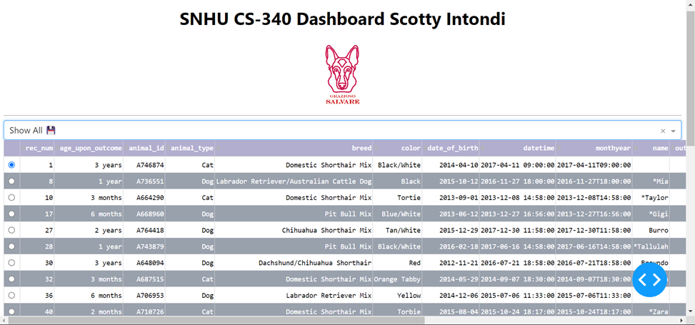
 

 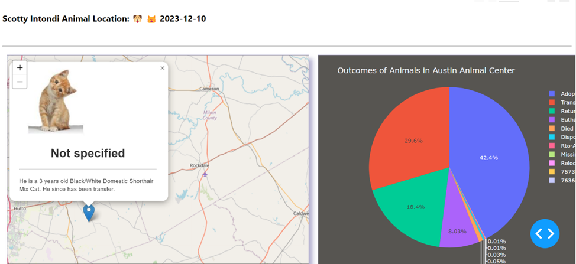
 

<h3>“Water”:</h3>
 
 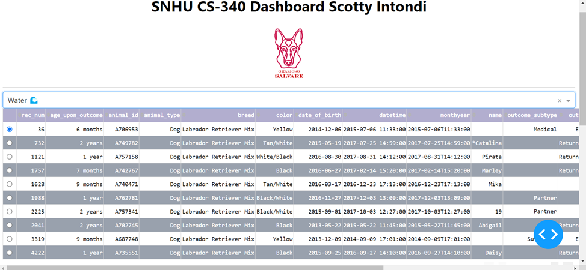
 

 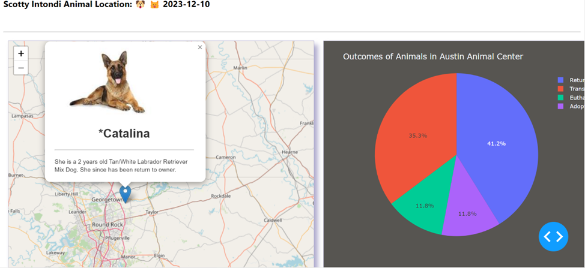
 

<h3>“Mountain”:</h3>
 
 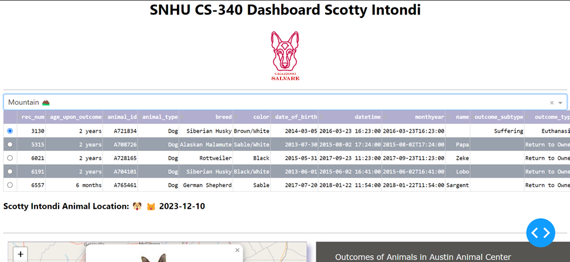
 

 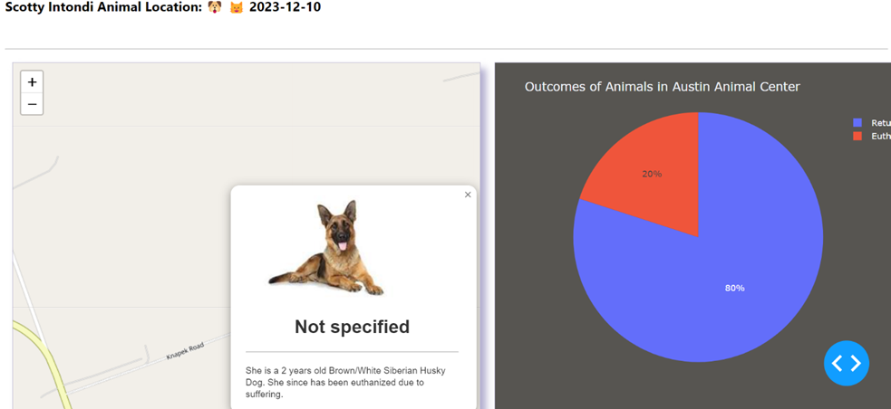
 

<h3>“Disaster”:</h3>
 
 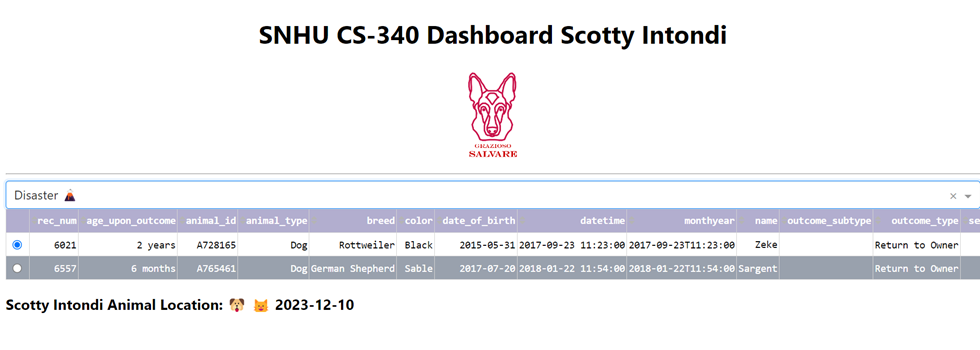
 

 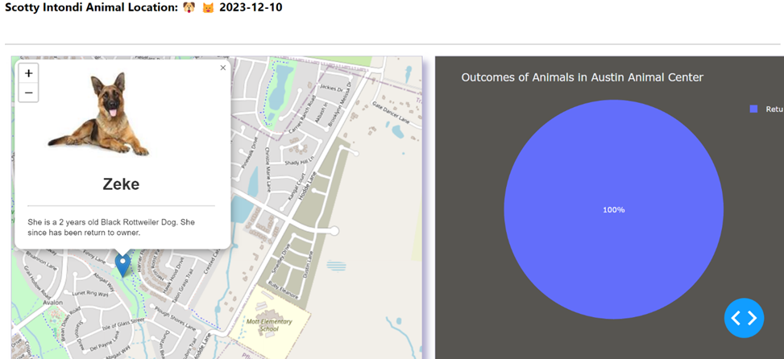
 

<h3>“Elderly”:</h3>
 
 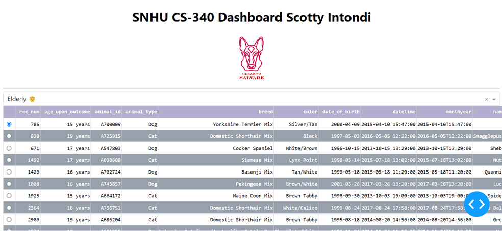
 

 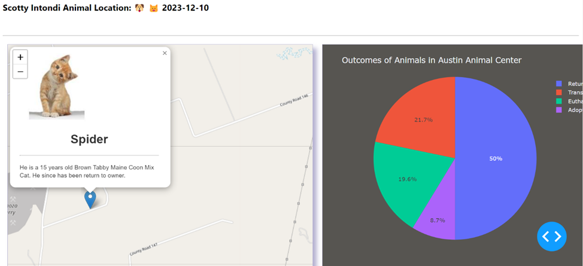

<h3>Challenges:</h3>

&nbsp;&nbsp; Working with the callbacks in Dash was a little different as although it’s made in JavaScript, you can’t grab the tags in Dash the same way through the DOM. You have to go through the children such as plotly etc… Also, callbacks are imminently called once the page is opened and I probably should’ve suppressed the initial nth click and be greater than 0 to keep from rendering on refreash.

 
<h3>Contact<h3>

Scotty Intondi

email: intondiscott@snhu.edu

CS-340 Client/Server Development

